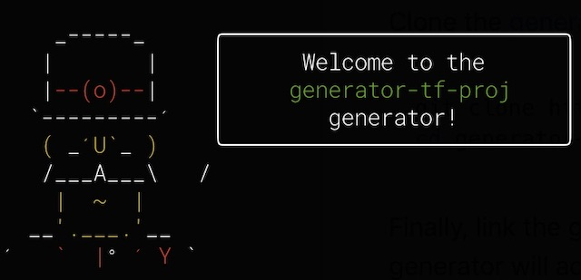

 

# About

This yeoman generator will create scaffolding for creating terraform for AWS resources. 

I decided to create a terraform generator after seeing William Tsoi's excellent [generator-terraform-environments](https://github.com/williamtsoi1/generator-terraform-environments) project. I like to use a different directory structure for my projects, so I decided to create a generator that would use my preferred layout.

I'm eager to make this as usable as possible, so please consider entering bug reports and/or feature requests as needed.

# Installation

Yeoman requires Node.js and npm. You can install that from [here](https://nodejs.org/en/download/).

Once you have Node.js installed, then [install Yeoman](https://yeoman.io).

```shell
npm install -g yo
```

Now you can install generator-tf-proj.

```shell
npm install -g generator-tf-proj
```

**Note**: You can also clone the project from github, and then use `npm link` in the project's root directory. The link will make it so that the terraform project generator will act like you installed it using `npm install -g generator-tf-proj`.

```shell
npm link
```

# Yo - Go generate your project

Generate your new project using the yeoman command:

```shell
mkdir -p ~/my-projects/my-cool-project
cd ~/my-projects/my-cool-project
yo tf-proj
```

# Prompts

At this point you will be prompted to answer a number of questions about your project so that the scaffolding logic can build out the project structure.

## Project Description

 The project description will be used on a generated README.md file. Enter a simple description of your project. 
 
 We'll set up a project structure that can be used for creating a solr cluster in AWS.

```? Please provide a project description:  Create a solr cluster in AWS.```

## Logical Groups

This generator uses a set of group names for the AWS resource groups that will be deployed. The logical group folders will be created as a top level sub directory in your project directory. In our example, we will have one group of resources used for deploying solr nodes, and another for deploying zookeeper nodes.

```? What are the logical group names for your project (separate multiple responses by comma)? solr,zookeeper```

## Environment names

The next prompt is to get the names of the logical environments that you'll be using in AWS. The environment directories will be sub directories for each of your logical groups.

```? What logical environments will you be running (separate multiple responses by comma)? sandbox,stage,prod```

## Regions

The regions prompt will allow you to specify the region sub directory names. The region sub directories will be created in the environment sub directories.

```? What regions will you be running in (separate multiple responses by comma)? us-west-2```

## Components

The components prompt is for specifying names for the AWS resource groups. You could use a name like `networking` for resources like VPCs, subnets, etc, and use `ec2` for ec2 instances, autoscaling groups, target groups, etc.

```? What components will you be running (separate multiple responses by comma)? ec2,networking,lambda,s3```

## Provider

Currently, the generator only supports AWS.

```? What Terraform provider will you be using? (Full list of providers here: https://www.terraform.io/docs/providers): aws```

## Provider version

Enter the provider version.

```? What is the provider version?  1.7```

## Application group

The application_group can be used for setting a team name responsible for creating the resource. Our example is for creating a solr cluster, so we'll call our application group `search`.

```? What is your application group name? search```

## Business Owner

The next property is for setting the name of the business owner - this can be left blank.

```? Who is the business owner? Lee Wallen```

## Terraform backend state storage type

The tf-proj generator currently supports s3 and local. The backend settings will be created in a backend.tf file that will reside in the `./<group>/<region>/<component>` folder.

```? What state backend will you be using? (Full list of backends here: https://www.terraform.io/docs/backend/types/index.html): s3```

## Terraform state S3 bucket name

We stated above that we wanted to use S3 for storing the terraform state files, so now we'll be prompted for the S3 bucket name.

```? Name of the S3 Bucket for remote terraform state: my-bucket```

## Terraform state file key prefix

You'll be prompted for a prefix to use for terraform state file. The prefix will be used to create a key following the pattern found in the `subgroups/environments/regions/backend.tf` template file:

`<%= backendBucketKeyPrefix %>/<%= environment %>/<%= region %>/terraform.tfstate`

```? The key prefix for the remote terraform state files: terraform-remote-state```

## Terraform state file bucket region

Enter the region name to use for storing the S3 bucket.

```? The AWS region for the S3 Bucket us-west-2```

## Role ARN to use for accessing the bucket

Enter the Amazon Resource Name (ARN) to use for writing to the S3 bucket.

```? The default role arn to use when reading/writing the terraform state:  arn:aws:iam::ENTER_AN_ACCOUNT_NUMBER:role/ENTER_A_ROLE_NAME```

# Output

The generator will now create the directory structure for your project using the information from the prompts. 

**Note**: The generator also sets account name values based on the environment name.

 | Env | Mapped Account Name | Use |
|---|---|---|
| sandbox | sandbox | Initial development and experimentation. Resources can be deleted on a regular basis to reduce costs. |
| candidate | nonprod | Used for development, and is not expected to be a stable environment for integration testing. |
| stage | nonprod | Should look as much like production as possible. Teams can use the stage environment for integrated testing. |
| prod | prod | The `prod` environment is the only environment used in the `prod` account. |